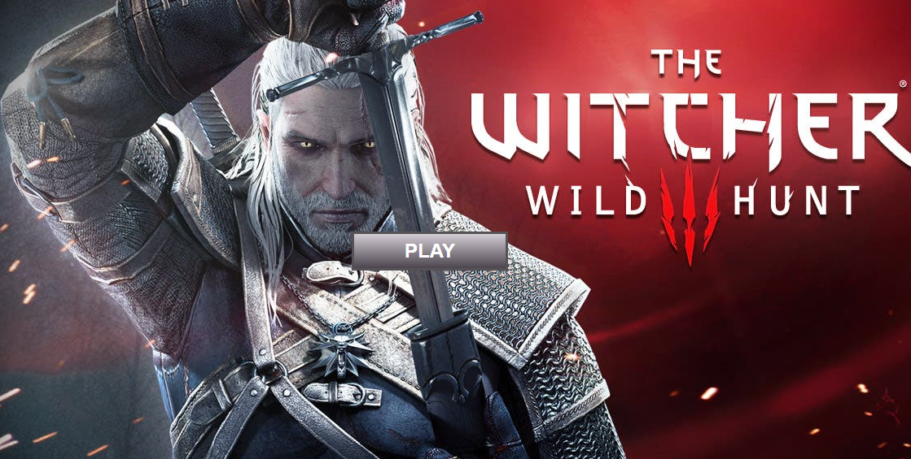

# Videojuego de lucha "The Witcher"
Simulación de un videojuego de lucha creado con **HTML, CSS3 y JS**.
Consta de una pantalla de inicio en la que al hacer click sobre el boton 'Play' se cambia de pantalla a otra donde aparecen 4 jugadores.

En esta pantalla se hace click sobre 2 jugadores para seleccionarlos y se pulsa el botón 'Fight' para comenzar la partida. 

En pantalla se verá qué jugador está atacando en cada momento, y en consola se puede ver un muestreo en tiempo real de los puntos que lleva cada jugador.

Al final aparacerá un alert anunciando el ganador de la partida.

Autor: Lucía Bermejo Solivellas.
https://lubersol.github.io/videojuego/
